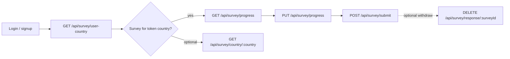
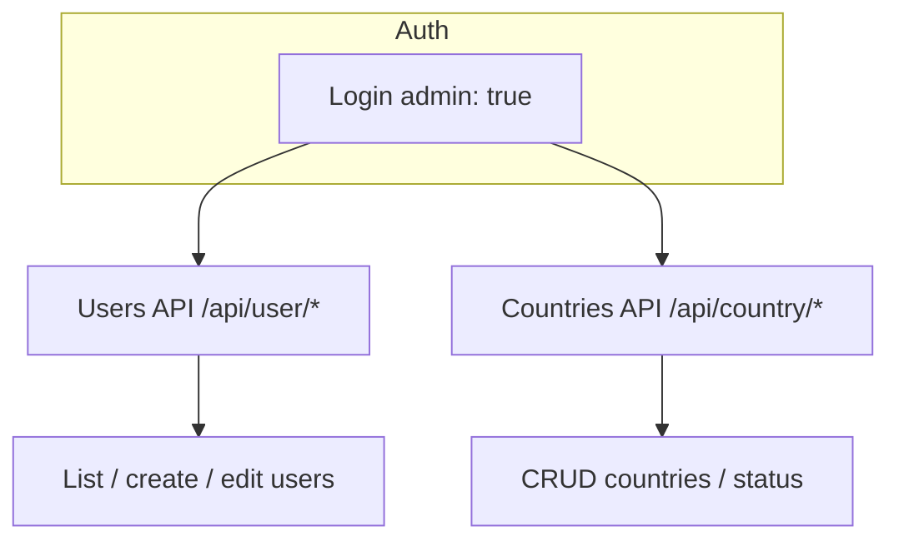
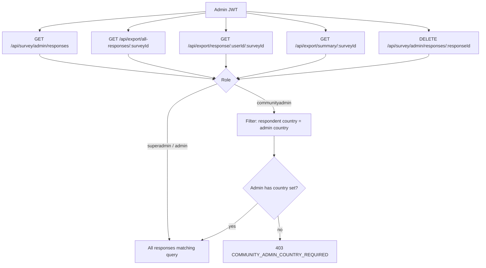
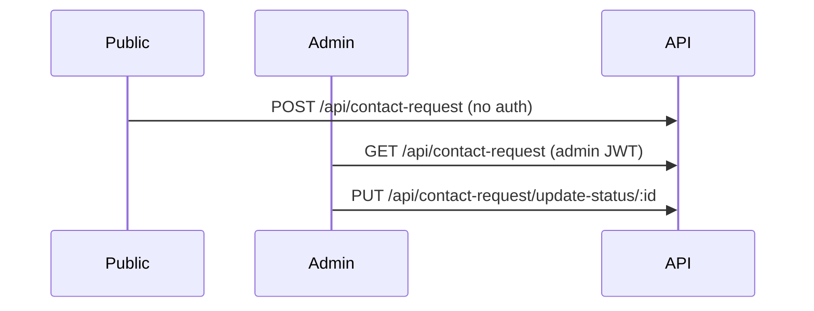

# KeyPop API — Flows

High-level request and business flows. For endpoint details and payloads, see the [README](../README.md) API section.

## Actors and roles

| Role | Purpose |
|------|---------|
| `user` | Participant; takes surveys tied to their `country`. |
| `admin` | Full admin (non–community-scoped). |
| `superadmin` | Same API scope as `admin` for survey responses and exports. |
| `communityadmin` | Admin limited to data where respondent’s `User.country` matches their own `User.country`. |

## Authentication flow

```mermaid
sequenceDiagram
  participant Client
  participant API
  participant DB

  Client->>API: POST /api/auth/login { email, password, admin? }
  API->>DB: User.findOne({ email })
  DB-->>API: user + password hash
  API->>API: bcrypt.compare; if admin flag, require admin role
  API->>API: JWT.sign({ id, role })
  API-->>Client: { success, data: { user, token } }

  Note over Client,API: Subsequent requests
  Client->>API: Headers: Authorization: Bearer <token>
  API->>API: jwt.verify; User.findById
  API->>API: attach req.user; continue
```

- **Participant login:** send `admin: false` or omit `admin`.
- **Admin panel login:** send `admin: true`; only `admin`, `superadmin`, `communityadmin` succeed.

## Participant: survey discovery and submission



- Progress is saved incrementally; submit finalizes a `SurveyResponse`.
- `GET /api/survey/responses` lists **only the logged-in user’s** submissions.

## Admin: user and country management



- Most `/api/user` mutating routes use `authMiddleware` + `requireAdminRole`.
- `DELETE /api/user/:id` uses auth only (no `requireAdminRole` in code); confirm policy for production.

## Admin: survey responses and exports



- JSON listing for dashboards: **`GET /api/survey/admin/responses`** (query: `page`, `limit`, optional `surveyId`, `status`).
- Delete one response: **`DELETE /api/survey/admin/responses/:responseId`** (same community-admin rules as exports).
- Participants may remove their own submission: **`DELETE /api/survey/response/:surveyId`**.
- PDF/CSV downloads: **`/api/export/*`** with `format=pdf` or `format=csv`.

## Contact requests (public + admin)



## Error handling (typical)

- **`sendResponse` / `ApiError`:** `{ success: false, message: "..." }` with HTTP status; stack may appear in development (`GlobalErrorHandler`).
- **`requireAdminRole` failure:** `403`, `{ success: false, error: "Access denied..." }` (uses `error`, not `message`).
- **Auth middleware:** `401`, `{ success: false, error: "..." }`.

## Static assets

- Non-production: `/static` from `src/assets`.
- Production (`dist`): `/static` from `dist/assets` (after `npm run build`).
